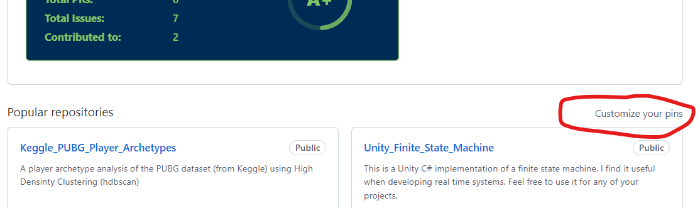
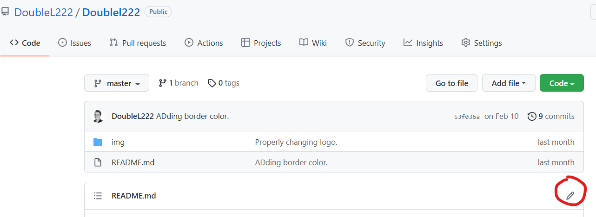
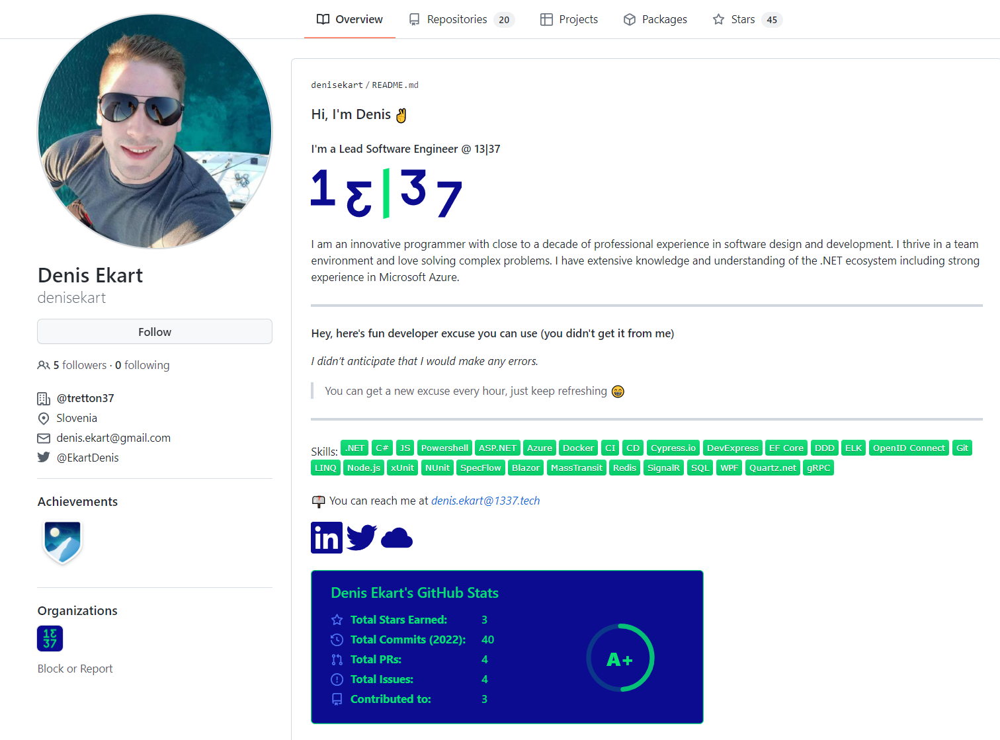

# GitHub profile guide

This guide is meant to help you present yourself on GitHub. This will help you in making a good impression on potential clients, future employers etc.

---

## Join 13|37 on Github

Join the 13|37 organization on GitHub - https://github.com/tretton37/.
You can do this by opening a ticket at https://service.tretton37.com. Make sure to write your GitHub username in the ticket.

For your profile to be shown publicly as part of 13|37 you need to
do the following steps:

-   Go to the organization page - https://github.com/tretton37/.

-   Click on people.

-   Find yourself on the list.

-   Change the organization visibility from private to **public**.

## Your profile info

You should fill out your GitHub profile info. You can access it via https://github.com/ + *\<your GitHub
username\>* by clicking on "Edit Profile" under your profile picture.

### 1. Add a profile picture.

### 2. Set your name.

### 3. Write a bio.

Make sure to include the technologies you
specialize in. 

### 5. Write your email.

You can use your @13|37.com address or not. If you use your address you could include your @13|37.com address in your readme as I did.

### 4. (Optional) Specify employer.

### 6. (Optional) Specify your work location.

### 7. (Optional) Specify website and Twitter.

## Featuring your projects

You should feature the repositories that you are proud of on your profile. You
do this by going to your profile and "pining" those projects. To access the pinning feature click "Customize your pins" on the top right of your project list.

**You should always include a README.md file** in your project, which explains
what the project is and how to use it.

## Leveling up your GitHub profile

You can actually do a lot with the front page of your github profile (see two examples below). You do this by adding a README.md file to your profile page. Follow these steps to do so:

### 1. Create the repository for the README.md file

You will need to create a new public repository with the same name as your
GitHub username like so:

**Remember to tick the "Add a README file" checkbox and click "Create repository".**
### 2. Edit your README.md file
To edit your readme file simply go to the repository you just created, find the README.md file and click the edit icon on the top right, like so:

### 3.1 Create your README.md file content with the 13|37 branded generator
The OSS team has created a [readme generator](https://oss-tools.1337.services/readmemaker/index.html) to help you make a 13|37 branded readme. With a few clicks you can create an awesome profile as Denis has:

To use the generator, enter the information in various forms. After you are done copy the generated mardkown text (bottom right) to your README.md file.

### 3.2 Or create your README file manually

If you want your profile to be more personalized you can create it manually and still achieve good results like Luka did here:

The README file is written in a markup language called markdown. If you're not familiar with it and have plenty of time, [here is the getting started
guide](https://www.markdownguide.org/getting-started/) and if you are lacking time [here is a cheat sheet](https://www.markdownguide.org/cheat-sheet/).

Now you can more effectively express yourself by using links, images, [badges](https://dev.to/envoy_/150-badges-for-github-pnk), 
[emojis](https://gist.github.com/rxaviers/7360908) and even HTML. 

You can also add various cool widgets to your GitHub readme like the
[github-readme-stats](https://github.com/anuraghazra/github-readme-stats).

Here is Luka's README.md:

You can look at an example of everything mentioned [on Luka's repository](https://github.com/DoubleL222/Doublel222) (click on raw view to look
at the code).

## GitHub Pages

GitHub Pages is a tool that enables you to easily showcase your profile, project or organisation as a static webpage. GitHub will host your webpage for free.

So here is how to do it:

### For Users & Organisations

### Create a new repository

You will need to create a new public repository with the name *GitHubUsername*.github.io. Like so:

### Add an index.html file

To add an index.html to your repository you will need to clone your repo and push the changes. See [other guides](https://docs.github.com/en/repositories/creating-and-managing-repositories/cloning-a-repository) if you are unsure how to do this.

I've added a simple index file with my favourite code editor Visual Studio Code:

Now [push this file](https://docs.github.com/en/repositories/working-with-files/managing-files/adding-a-file-to-a-repository) to your repository.

### Visit your website

You can find your website at *GitHubUsername*.github.io . Here is what mine looks like on my favourite browser:

### Adding a GitHub page to a repository

First, add the index.html file to somewhere in your repository. It is recommended to make a new branch specifically for this purpose.
Now go to your repository and click settings. In the Pages tab you need to point to that index page in its respective branch:

And that's it!

### Read on

[Click here to learn more about GitHub pages.](https://docs.github.com/en/pages/getting-started-with-github-pages/about-github-pages)