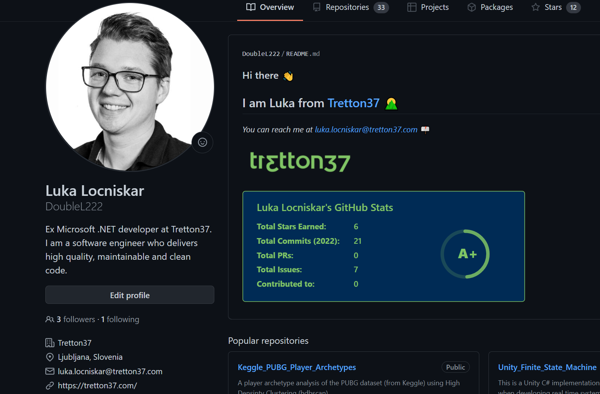
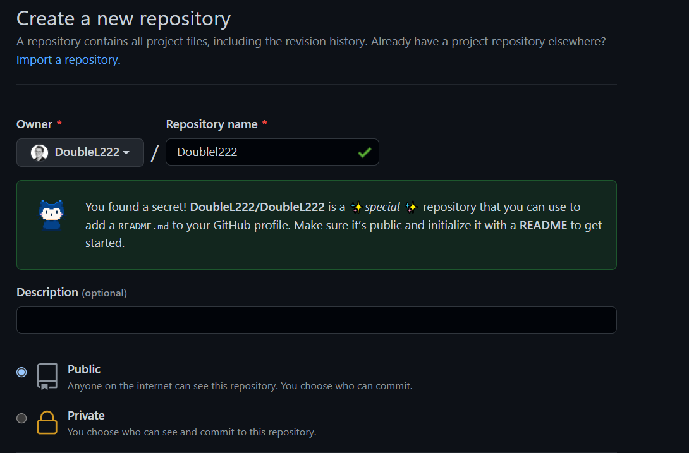
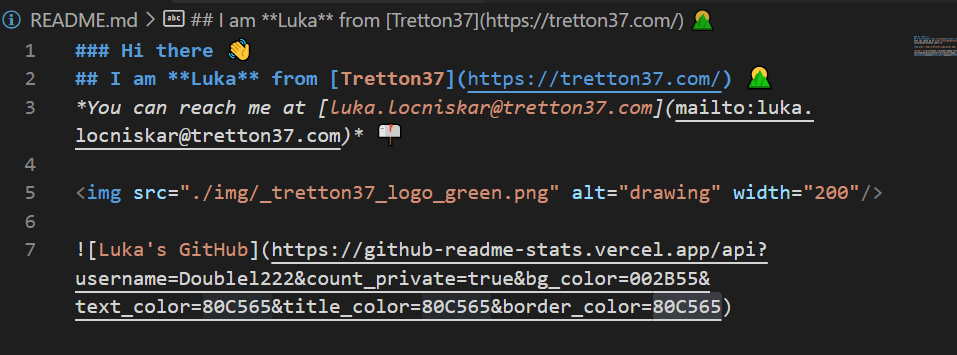
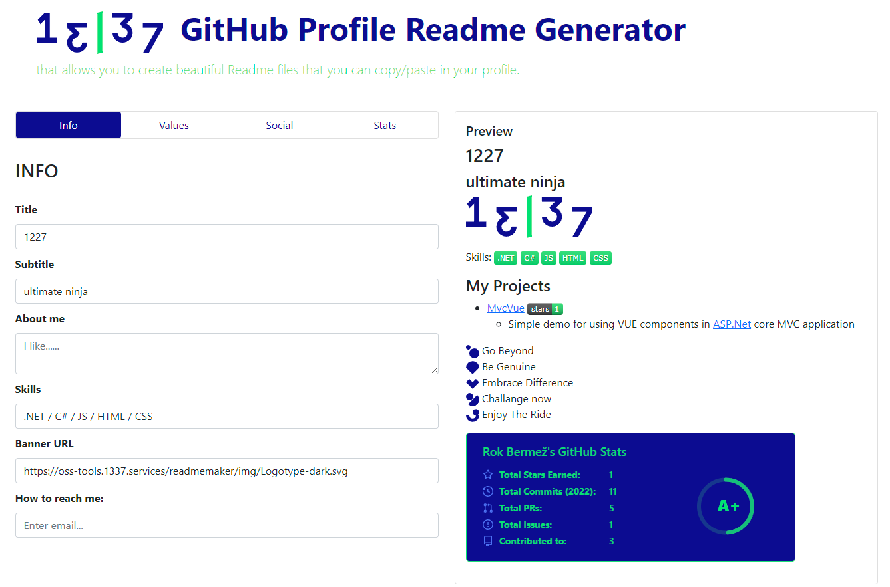
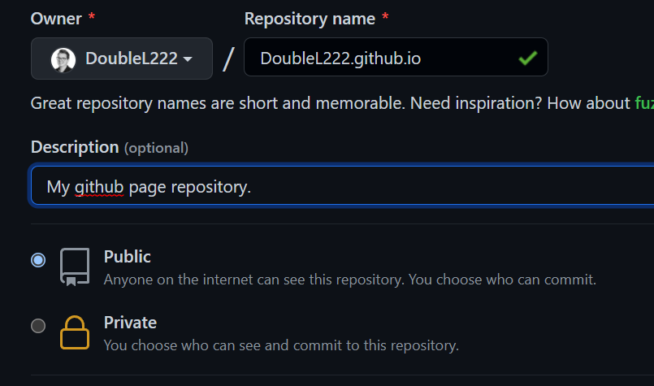
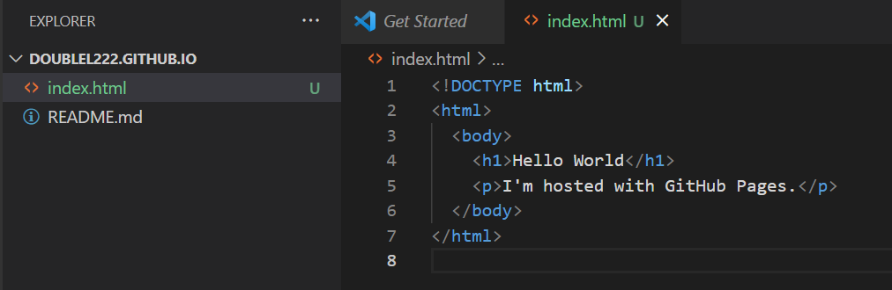
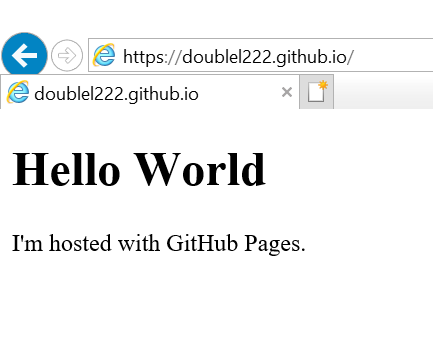
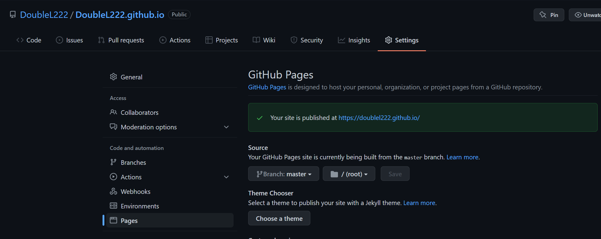

# A GitHub guide

This guide is meant to help you properly present yourself on a public git
repository. This will aid you in making a good impression on project owners.
Even if not, having a good GitHub profile is beneficial for your career as a
developer in the long term.

GitHub is the leading online git repository so it is very likely that the
open-source project you will be contributing to will be hosted there. If it is
not, apply the same principles to the hosting service you will be using.

If you follow this guide you might end up with a profile looking something like this:

---

## Join 13|37 on Github

Join the 13|37 organization on GitHub - https://github.com/tretton37/.
You can do this by opening a ticket at https://service.tretton37.com. Make sure to write your GitHub username in the ticket.

If you wish your profile to be shown publicly as part of 13|37 you need to
do the following steps:

-   Go to the organization page - https://github.com/tretton37/.

-   Click on people.

-   Find yourself on the list.

-   Change the organization visibility from private to **public**.

## Your profile info

You should fill out your GitHub profile info. You can access it  via https://github.com/ + *\<your GitHub
username\>*.

TODO: (*recommendation, not requirement*)

### 1. Add a profile picture.

### 2. Set your name.

### 3. Write a bio.

Make sure to include the technologies you
specialize in. 

### 5. Write your email.

You can use your @13|37.com address or not. If you use your address you could include your @13|37.com address in your readme as I did.

### 4. (Optional) Specify employer.

### 6. (Optional) Specify your work location.

### 7. (Optional) Specify website and Twitter.

## The code

On GitHub, your projects and your contributions to other projects should speak
to the quality of your engineering skills.

### Your contributions

The strength of a GitHub profile is measured in its contribution frequency. If
you want to rise to the top you need to contribute and contribute often. If you
are using any project or code hosted on GitHub, keep an eye out for issues, bugs
or errors that you find. Post these as issues on the repository pages. You
should also look through open issues of the project you are familiar with and
contribute by either fixing them or adding your input.

Be aware that in public repositories anyone can browse any commits, commit
messages and commit frequency. Make sure that all the code you commit is of high
quality and adheres to clean coding principles and the rules of the repository
you are committing to.

### Featuring your projects

You should feature the repositories that you are proud of on your profile. You
do this by going to your profile and "pining" those projects.

**You should always include a README.md file** in your project, which explains
what the project is and how to use it.

## Leveling up your GitHub profile

As you can see in the profile example at the top it has a README.md
file on the GitHub profile. It contains some information, some links, and some
nice visualizations about various projects and contributions. Let me show you how to
replicate that.

### 1. Create the repository for the README

You will need to create a new public repository with the same name as your
GitHub username like so:

**Remember to tick the "Add a README file" checkbox and click "Create repository".**

### 2. Edit your README file

The README file is written in a markup language called markdown. If you're not familiar with it and have plenty of time, [here is the getting started
guide](https://www.markdownguide.org/getting-started/) and if you are lacking time [here is a cheat sheet](https://www.markdownguide.org/cheat-sheet/).

Now you can more effectively express yourself by using links, images,
[emojis](https://gist.github.com/rxaviers/7360908) and even HTML. 

[Here](https://dev.to/envoy_/150-badges-for-github-pnk) is a list of 150 GitHub badges that you can use.

You can also add various cool widgets to your GitHub readme like the
[github-readme-stats](https://github.com/anuraghazra/github-readme-stats).

Here is my README.md:

You can look at an example of everything mentioned [on my
repository](https://github.com/DoubleL222/Doublel222) (click on raw view to look
at the code).

### 3. (Optional) Create your readme file with the 13|37 branded generator
The OSS team has created a [readme generator](https://oss-tools.1337.services/readmemaker/index.html) to help you make a 13|37 branded readme. With a few clicks you can create something awesome like this:

All you need to do is enter the information in the forms. Then copy the generated content on the right to your README.MD file.

**PS: the same can be done for organizations and projects.**

## GitHub Pages

GitHub Pages is a tool to easily showcase your profile, project or organisation as a static webpage. GitHub will host your webpage for free.

So here is how to do it:

### For Users & Organisations

### Create a new repository

You will need to create a new public repository with the name *GitHubUsername*.github.io. Like so:

### Add an index.html file

To add an index.html to your repository you will need to clone your repo and push the changes. See [other guides](https://docs.github.com/en/repositories/creating-and-managing-repositories/cloning-a-repository) if you are unsure how to do this.

I've added a simple index file with my favourite code editor Visual Studio Code:

Now [push this file](https://docs.github.com/en/repositories/working-with-files/managing-files/adding-a-file-to-a-repository) to your repository.

### Visit your website

You can find your website at *GitHubUsername*.github.io . Here is what mine looks like on my favourite browser:

### Adding a GitHub page to a repository

First, add the index.html file to somewhere in your repository. It is recommended to make a new branch specifically for this purpose.
Now go to your repository and click settings. In the Pages tab you need to point to that index page in its respective branch:

And that's it!

### Read on

[Click here to learn more about GitHub pages.](https://docs.github.com/en/pages/getting-started-with-github-pages/about-github-pages)