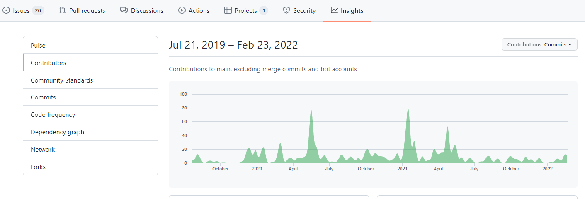

# 13|37 Open Source Contribution Policy

## Overview and purpose

 It is the policy of **13|37** to use, contribute to, and publish Free and Open Source Software (“FOSS”) when doing so furthers the Company’s business purposes and does not present unacceptable risks.

This policy is intended to minimize these risks, comport with the recommendations and best practices to ensure that, in using and contributing to FOSS, the Company and its employees respect the rights of third parties, comply with applicable regulations, and engage productively with the FOSS community.

## Contributing to open source

In the time between assignments employees can contribute to one of the open-source projects from our [project list](/docs/projects.md). This will allow you to give back to the community and improve your skills at the same time. Together with your manager, you should decide on which project you will be contributing to.

## Selecting the projects

It is one of the responsibilities of competence group leads to select one or more open-source projects for their respective competence groups. After being selected these projects should be listed in our [project list](/docs/projects.md). The competence group members are advised to work on open-source projects of their groups.

 Employees who are not competence leads have the opportunity to nominate an open-source project. If anyone has their own open-source project or is really passionate about one they can reach out to an appropriate competence lead and nominate the project.

## Guidelines for selecting a project

When choosing OSS projects to which we as a company would like to contribute, there are some factors to keep in mind. This section will break down the main considerations and help guide you towards an awesome project that will benefit us in multiple aspects.

Before diving into the following sub-sections, please keep in mind that employees 
who will be working on the projects should have the ability to learn something new from the experience as well as have fun.

### Licensing

Try finding an open-source project with a license `LICENSE` which has a non-restrictive licensing scheme. These are some of such open-source licenses:

- Mozilla Public License, 1.0, 1.1 and 2.0 variants
- MIT License
- Berkeley Software Distribution (BSD), 3-clause, 2-clause and 0-clause variants
- Apache License, 1.0, 1.1 and 2.0 variants
- Common Development and Distribution License (CDDL)

Some projects do not have a license specified. If you still consider such a project a strong candidate, try reaching out to the maintainers to see if they can add a `LICENSE` to the project.

### Activity

A good metric to determine if a project is worth contributing to is how active it is. A good measure to determine that is the number of PRs closed during a recent period. Often, the open-source project will have *Insights* enabled. You can gauge project activity and trends from the metrics displayed there.

### Community

One way to make sure our contributions will be accepted and valued is to determine if newcomers have a good experience and can be onboarded easily. To determine that, check if:

- There is clean and maintained documentation. This includes `README`, `CODE OF CONDUCT` and other *community standards* documents that aid in onboarding.
- The coding practices and standards used by the project are distinguished and enforced.
- There is a clear indication that issues can be worked on by anyone. Project maintainers usually mark such issues with tags like `good-first-issue`, `help-wanted` or `up-for-grabs`.
- Maintainers and the community are responsive and are willing to engage in constructive code reviews and other activities directly related to development.
- Owners and maintainers are responsive and willing to discuss a more strategic approach to contributing to their open-source project.

### Impact

When deciding what projects to choose, it is important to consider the impact our contributions may produce. Determining impact is usually a multivariate equation. Some of the components that can help you decide are:

- Number of stars the project has earned on GitHub
- Number of downloads (npm, NuGet, ...) or users that the project currently has
- Number of our clients that depend on the software
- Popularity and visibility of the project in different social circles

## Working groups (an alternative to projects)
If you need more guidance and a more involved active community in your open-source journey, you might consider working groups. Working groups are much more organized than a set of individuals contributing to a project. Working groups do have specific projects they work on, but the organisation is more people-centric than project-centric. You can google a technology + working group to see if there are working groups for your tech stack, like the [Node.js working groups](https://nodejs.org/en/about/working-groups/). You can also check out the open [source initiative working groups](https://opensource.org/working_groups).

## The Contributors License Agreement (CLAs)

Some projects require you to sign a Contributors License Agreement (CLA) before the contribution will be accepted.

Most CLAs contain terms that we are okay signing. If you are in doubt contact Head of Competence Development.

## Contributions

Firstly, you can contribute much more than code to an open-source project. Using your writing, design and organizing skills can also bring value. See the [contribution guide](contribution-guide.md) for more detail.

But when it comes to code it is always better if you think things through first. Most of the time, a code contribution to an open-source project is a normal and inconsequential task. But sometimes it's more than that. Try to follow these practices:

- We can only contribute code that we have the right to contribute. If you are having doubts, reach out to the Head of Competence Development.
- Don’t contribute code that exposes sensitive or proprietary information.
- Don’t contribute sub-par code. Your contributions are a reflection of your engineering skills. We’d rather take the time and get another set of eyes and do a proper code review.

## Logging your time in Visma
Time spent on open source goes under a specific project in Visma.

## Summary

We encourage you to contribute to open-source projects. You don’t need our review and approval for the contribution you make, we’re not here to slow you down. Rather, we want to highlight potential issues and address them for you.

- Assuming your code is awesome, the project you are contributing to is active, and you don’t anticipate any concerns with the contribution, then contribute to the project.
- If you have any questions, see anything strange about the project, are asked to sign something, aren’t sure if you need to add a copyright statement to some file header, or anything that gives you pause, let us help you _(Todo: HOW)_.

## Additional Considerations

- When we have multiple groups at the company who contribute to the same project, we encourage you to reach out to your colleagues and coordinate your efforts internally.
- If you encounter any conduct issues with the project you are working on (e.g. if anyone in the community engages in misbehaviour toward you or anyone else), please don’t engage in an online spat as these can escalate in non-productive ways. 
- If you don't know how to proceed or have any other questions you can contact Head of Competence Development.