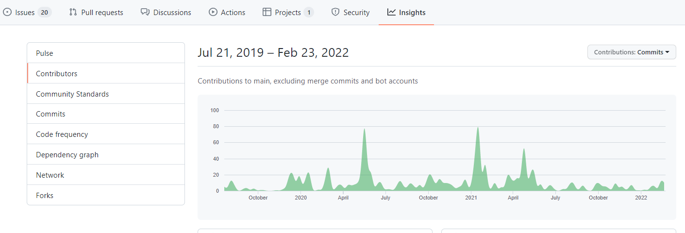

# 13|37 Open Source Guideline

Hej! This document is a guide to how and why we contribute to open source-projects within **13|37**.

There are three main why's when it comes to working on open-source projects at **13|37**. These are:

- Giving back to the community.
- Empowering our employees to learn and grow by working on open-source projects.
- Improving the image of **13|37** in the eyes of future employees and clients.

You will be achieveing all of these by working on open-source projects. So let's get right into the how.

The rest of this document is split into two main sections: -For Contributors, and -For Organizers. If you are tasked with contributing to open-source, you should read the former and if you are tasked with organizing open-source work (as a competence group lead or otherwise) you should read the latter.

---

# For Contributors

So, you have decided to join our open-source initative and grow with us? That is fantastic.

Just to reiterate a few benefits... you will be giving back to the open-source communities which provide us the tools to be better at our jobs. You will also be contributing to the growing pool of **13|37** employees and improving our public reputation while doing so.

Most importantly however, you will be growing yourself. Not just by gaining additional skills and honing your existing ones. You will also be growing your personal brand as an open-source contributor. The strength of your public profile (likely on GitHub) can make or break your next interview.

## Who should contribute?

It is a common misconception that to contribute to open-source projects, one has to code. Not true. Most open-source projects require much more than just code. You can use many other skills to help, such as:

 - Design skills (improve styling, UX, branding...) 
 - Writing skills (documentation, guides, translations...)
 - Organization skills (knowledge sharing sessions, events, Q&A help..)
 - And of course... Coding skills (resolve issues, review pull requests..)

## When to contribute?

We encourage all employees, when they have sufficient extra time, to contribute to open-source projects. But especially engineers when they are between assignments should consider contributing as one of the higher priorities. 

## Which project to contribute to?

There is a [list of projects](/docs/projects.md) to which we at **13|37** contribute to. If you are currently part of a competence group then the obvious choice should be one of the projects assigned to your competence group (found on the list). In general you can pick any project from the list. Try to find one that alligns with your skillset and your interests. In any case you should make this decission together with your manager.

## Where to start? - Picking your first issue

You should first familiarize yourself with what the project does and how it works. This should be written in the projects Readme.md file and presented on it's front page ([example](https://github.com/bUnit-dev/bUnit)). Most projects also have some documentation, hosted on a different website and linked from the readme. You should read through that, deploy the project (if applicable) and have a general look around.

After you've familiarised yourself with the project have a look through the open issues of that project ([example](https://github.com/bUnit-dev/bUnit/issues)). There is usually a tagging strategy which markes the types of issues. You should keep an eye out for issues taged with "good first issue" or "need help". Look through these issues, find one that you understand and would like to resolve. 

Then "claim" the issue by commenting on it saying something like "I would like to resolve this issue".

You can also look through the pull requests of a project ([example](https://github.com/bUnit-dev/bUnit/pulls)). This will give you insight into the codebase and the coding standards.

## How to ask for help?

Before you ask your question be sure to do your homework. See if the question has already been asked by googling it. Also look through the documentation if the answer lies within. 

If you cannot find the answer on your own you should reach out for help. Before posting a question I recommend reading [this guide](https://stackoverflow.com/help/how-to-ask) on how to ask a coding question well.

To reach out you can:
- Message a colleague who is on the project.
- Comment on the issue you've taken.
- Write to the forum (if there is one).
- Open a new issue on the project.
- Write directly to the project maintainers.

## How to submit a contribution?
You submit contributions via pull requests. This might be less familiar to our non-engineer colleagues. Put simply a pull request is a request to accept some changes that you have made to a project.

Projects generally have a set of contribution guidelines which state what a pull request should contain. Be sure to follow this when submitting apull request.

It is usually better to open a pull request early on, so others can watch or give feedback on your progress. Make sure to mark the pull request as WIP - work in progress if you do so.

Here are the steps to make a change and submit a pull request on GitHub:
- [Fork the repository and clone it locally.](https://docs.github.com/en/get-started/quickstart/contributing-to-projects)
- [Create a branch.](https://docs.github.com/en/get-started/quickstart/github-flow)
- Make your changes.
- Reference your issue in the title or description. (example. Closes #37)
- [Push your changes (same article as above)](https://docs.github.com/en/get-started/quickstart/contributing-to-projects)

Now keep your eyes open for reviews and address any comments. When your pull request receives comments you should address them by replying or by adjusting your code and updating your pull reqeuest.

## How to log your time?

We want to keep track of how many hours our employees spend on working on open-soruce projects. This is why we ask you to log your time under the **TODO : INSERT PROJECT** project in Visma.

## What to be careful of?

When it comes to code it is always better if you think things through first. Most of the time, a code contribution to an open-source project is a normal and inconsequential task. But sometimes it's more than that. Try to follow these practices:

- We can only contribute code that we have the right to contribute. If you are having doubts, reach out to the Head of Competence Development.
- Don’t contribute code that exposes sensitive or proprietary information.
- Don’t contribute sub-par code. Your contributions are a reflection of your engineering skills. We’d rather take the time and get another set of eyes and do a proper code review.

---

# For organizers

This section is meant for open-source project organizers. Those who select projects and facilitate contributions to said projects.

## Who are the organizers?

The organizers of open-source contributing are Competence Group Leads. You can find the list of all [current competence groups here](https://app.happeo.com/pages/1evsd05ab40fbrg1f5/CompetenceGroups/1evsd3dtmlcl0pb4gs).Each lead has a duty to select one or more open-source project (if applicable) for their respective competence groups.

Employees who are not competence group leads have the opportunity to nominate open-source projects to the leads. The lead have the duty to facilitate this process and the discretion to select the most appropriate projects.

## How to select the projects?

It is important to keep in mind the three main reasons of **13|37** open-source contributions. To reiterate, these are:
- Giving back to the community.
- Empowering our employees to learn and grow by working on open-source projects.
- Improving the image of **13|37** in the eyes of future employees and clients.

Wit those in mind we also have criteria for the best open-source projec candidate. An ideal project should:
- Be understaffed.
- Be popular.
- Have potentaial.

These are the core guidelines for selecting a project. In the following sections we will go into some detail with more suggestions on how to select a project.

---
**End of rewrite**

---

### The Contributors License Agreement (CLAs)

Some projects require you to sign a Contributors License Agreement (CLA) before the contribution will be accepted.

Most CLAs contain terms that we are okay signing. If you are in doubt contact Head of Competence Development.

### Licensing

Try finding an open-source project with a license `LICENSE` which has a non-restrictive licensing scheme. These are some of such open-source licenses:

- Mozilla Public License, 1.0, 1.1 and 2.0 variants
- MIT License
- Berkeley Software Distribution (BSD), 3-clause, 2-clause and 0-clause variants
- Apache License, 1.0, 1.1 and 2.0 variants
- Common Development and Distribution License (CDDL)

Some projects do not have a license specified. If you still consider such a project a strong candidate, try reaching out to the maintainers to see if they can add a `LICENSE` to the project.

### Activity

A good metric to determine if a project is worth contributing to is how active it is. A good measure to determine that is the number of PRs closed during a recent period. Often, the open-source project will have *Insights* enabled. You can gauge project activity and trends from the metrics displayed there.

### Community

One way to make sure our contributions will be accepted and valued is to determine if newcomers have a good experience and can be onboarded easily. To determine that, check if:

- There is clean and maintained documentation. This includes `README`, `CODE OF CONDUCT` and other *community standards* documents that aid in onboarding.
- The coding practices and standards used by the project are distinguished and enforced.
- There is a clear indication that issues can be worked on by anyone. Project maintainers usually mark such issues with tags like `good-first-issue`, `help-wanted` or `up-for-grabs`.
- Maintainers and the community are responsive and are willing to engage in constructive code reviews and other activities directly related to development.
- Owners and maintainers are responsive and willing to discuss a more strategic approach to contributing to their open-source project.

### Impact

When deciding what projects to choose, it is important to consider the impact our contributions may produce. Determining impact is usually a multivariate equation. Some of the components that can help you decide are:

- Number of stars the project has earned on GitHub
- Number of downloads (npm, NuGet, ...) or users that the project currently has
- Number of our clients that depend on the software
- Popularity and visibility of the project in different social circles

### Reaching out to project owners
We want to establish and keep a good relationship with the owners of the projects we contribute to. This has many benefits for both parties. We help the projects by contributing our time and knowledge and the project owners can reward us by giving us more privileges in the project and publicly acknowledging our contributions to the project.

The best way to reach out to the project owners is to start by using and contributing to the project. After some contributions, you can reach out to the project owners to establish a relationship.

Some project owners are open to establishing a relationship even before any contribution is made. When trying this path just be open and transparent about your intentions.

## Working groups (an alternative to projects)
If you need more guidance and a more involved active community in your open-source journey, you might consider working groups. Working groups are much more organized than a set of individuals contributing to a project. Working groups do have specific projects they work on, but the organisation is more people-centric than project-centric. You can google a technology + working group to see if there are working groups for your tech stack, like the [Node.js working groups](https://nodejs.org/en/about/working-groups/). You can also check out the  [open-source initiative working groups](https://opensource.org/working_groups) and these [open-source organisations, which also have working groups](https://opensource.com/resources/organizations).

# Summary

We encourage you to contribute to open-source projects. You don’t need our review and approval for the contribution you make, we’re not here to slow you down. Rather, we want to highlight potential issues and address them for you.

- Assuming your code is awesome, the project you are contributing to is active, and you don’t anticipate any concerns with the contribution, then contribute to the project.
- If you have any questions, see anything strange about the project, are asked to sign something, aren’t sure if you need to add a copyright statement to some file header, or anything that gives you pause, let us help you _(Todo: HOW)_.

## Additional Considerations

- When we have multiple groups at the company who contribute to the same project, we encourage you to reach out to your colleagues and coordinate your efforts internally.
- If you encounter any conduct issues with the project you are working on (e.g. if anyone in the community engages in misbehaviour toward you or anyone else), please don’t engage in an online spat as these can escalate in non-productive ways. 
- If you don't know how to proceed or have any other questions you can contact Head of Competence Development.